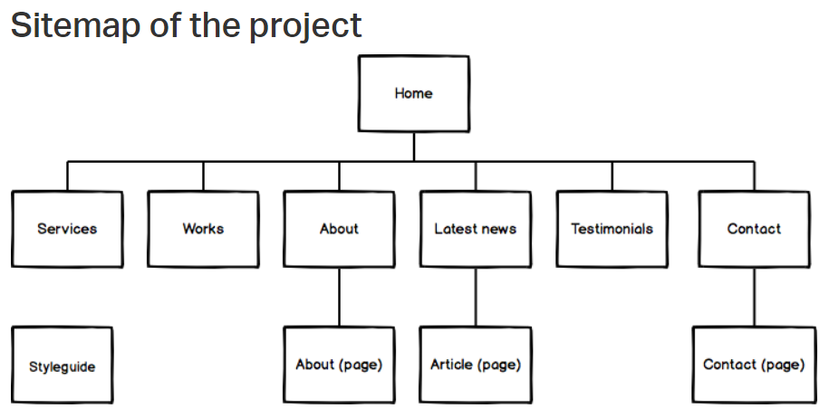

# Web Stack Specialization - Advanced HTML

## Building Techium's Website Skeleton

## Learning Objectives
* Light-weight wireframes vs Design specs
* Create the skeleton of a W3C compliant HTML5 page
* Apply semantic HTML tags to structure web page
* Block vs Inline HTML elements
* Semantic vs non-semantic HTML elements
* Semantic values of Landmark elements
* Identify and apply HTML attributes
* Difference between medias (SVG, GIF, PNG, JPG)
* Integrate video and audio contents
* Embed external content

